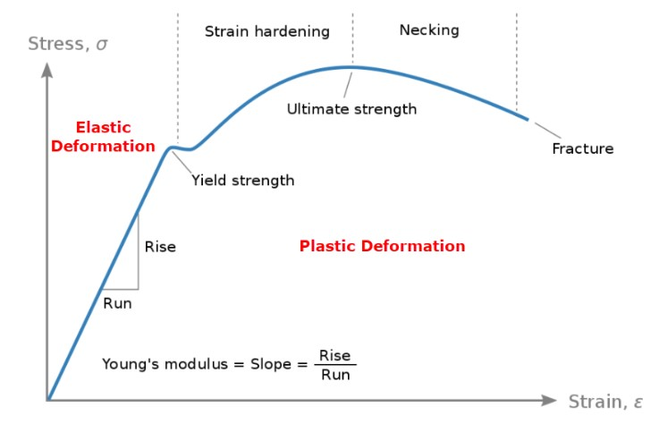
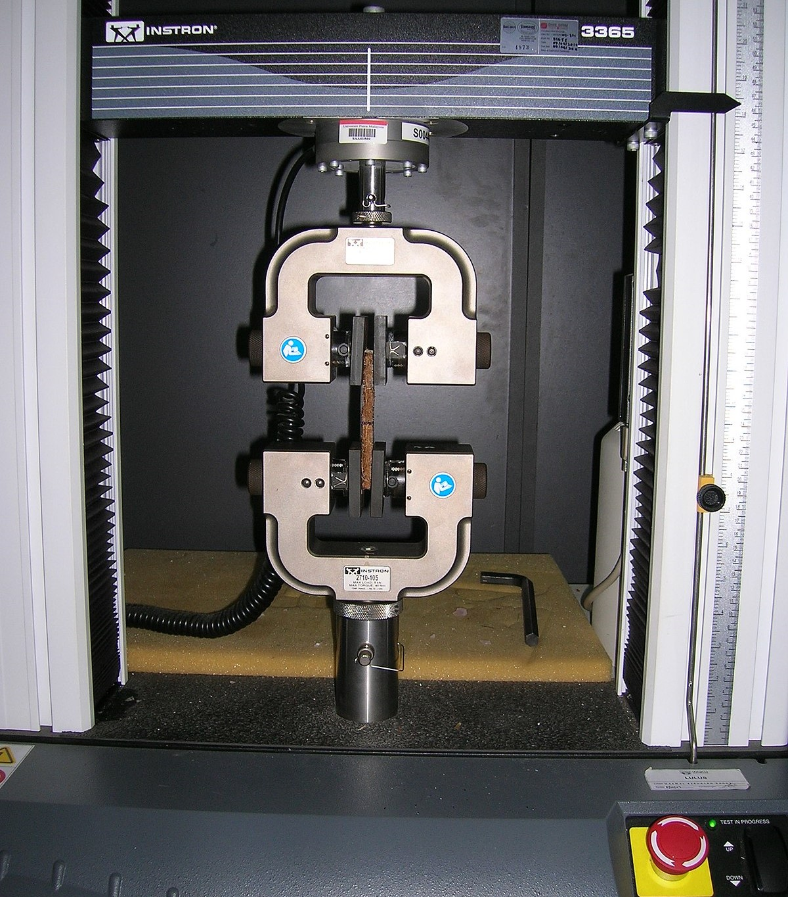
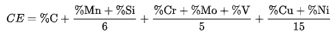
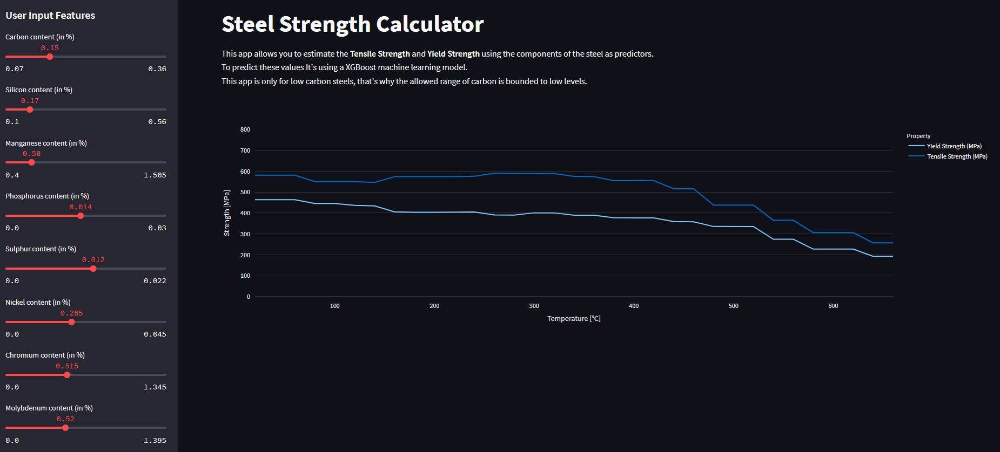

# Steel Strength Calculator

In this project I will try to predict the 
[**Tensile Strength**](https://en.wikipedia.org/wiki/Ultimate_tensile_strength) and the [**Yield Strength**](https://en.wikipedia.org/wiki/Yield_(engineering)) of steel alloys using the *steel composition* and *steel temperature* as predictors.

### What are these parameters of the steel?

#### Tensile Strength

**Ultimate tensile strength** (also called 
**UTS**, **tensile strength**, **TS** or **ultimate strength**) is the maximum stress that a material can withstand while being stretched or pulled before breaking. In brittle materials the ultimate tensile strength is close to the yield point, whereas in ductile materials the ultimate tensile strength can be higher.

Tensile strengths are rarely of any consequence in the design of ductile members, but they are important with brittle members.

#### Yield Strength

In materials science and engineering, the yield point is the point on a stress-strain curve that indicates the limit of elastic behavior and the beginning of plastic behavior. Below the yield point, a material will deform elastically and will return to its original shape when the applied stress is removed. Once the yield point is passed, some fraction of the deformation will be permanent and non-reversible and is known as [plastic deformation](https://en.wikipedia.org/wiki/Deformation_(engineering)#plastic_deformation).

The yield strength or yield stress is a material property and is the stress corresponding to the yield point at which the material begins to deform plastically. The yield strength is often used to determine the maximum allowable load in a mechanical component, since it represents the upper limit to forces that can be applied without producing permanent deformation

### Why is it important that we can estimate them?

The **ultimate tensile strength** and the **yield strength** are usually found by performing a tensile test and recording the engineering stress versus strain. The highest point of the stress–strain curve is the ultimate tensile strength and has units of stress. The equivalent point for the case of compression, instead of tension, is called the compressive strength.

Typically, the testing involves taking a small sample with a fixed cross-sectional area, and then pulling it with a tensometer at a constant strain (change in gauge length divided by initial gauge length) rate until the sample breaks.

This is a destructive test, and the machine to perform it is really expensive, that's why, if we can predict this values without the need of the test, we can save money, and also produce steels that are more suitable to the required task.

Two vises apply tension to a specimen by pulling at it, stretching the specimen until it fractures.

## Dataset

This dataset comes from [kaggle](https://www.kaggle.com/), and you can find it in [this link](https://www.kaggle.com/datasets/nitinsharma21/mechanical-properties-of-low-alloy-steel). It consists of 915 observations and 18 features

### Predictors

**Alloy code**: Id for the steel alloy  
**C**: Carbon content (in %)  
**Si**: Silicon content (in %)  
**Mn**: Manganese content (in %)  
**P**: Phosphorus content (in %)  
**S**: Sulfur content (in %)  
**Ni**: Nickel content (in %)  
**Cr**: Chromium content (in %)  
**Mo**: Molybdenum content (in %)  
**Cu**: Copper content (in %)  
**V**: Vanadium content (in %)  
**Al**: Aluminum content (in %)  
**N**: Nitrogen content (in %)  
**Nb + Ta**: Niobium + Tantalum content (in %)  
**Temperature**: temperature of the steel (in °C)  
**Ceq**: [Carbon equivalent content](https://en.wikipedia.org/wiki/Equivalent_carbon_content)

### Target
**Tensile Strength** (in MPa)  
**Yield Strength** (in MPa)

## Analysis

Most of the work is done in the [Analysis notebook](notebooks/Analysis.ipynb).

I start by cleaning the data. I rename the column names and the found how this dataset is structured. The dataset consist of 915 rows and 18 columns. One of the columns is the `Alloy Code`. This code is unique for each steel composition, meaning that all of the dataset rows with the same alloy code have the exact same composition, as expected. The difference between the different rows of the same steel alloy is the temperature at which the strength test was made, and of course the target variables, which vary a lot with temperature, as we will see.

This common alloy code means that the samples are not independent from each other, and samples of the same alloy may have similar characteristics. This is an important detail when we need to divide the dataset in train and test subsets, we shouldn't do it randomly, we need to keep the samples of the same alloy together, either in the train set or the test set, otherwise we could be masking a source of [data leakage](https://en.wikipedia.org/wiki/Leakage_(machine_learning)).

After the split, we have 76 alloys in the train set and 19 alloys in the test set

### Exploratory Data Analysis

After the split, we continue the analysis on the train set. The highlights of this part of the analysis are:

1. There are no missing values in the train set
2. The steel samples of the dataset are all of **low carbon steel**, with the highest carbon limit of 0.34%. This is important for our calculator, since we won't be able to predict the strength of steel with medium or high carbon steel, as our model won't be trained in those conditions.
3. In the target values I find some incorrect values, most likely due to data entry errors. I manually corrected the ones I detected
4. Temperature is negatively correlated with Strength, and is a very important factor
5. Temperature, vanadium and manganese are the most important factors in the determination of the steel strength

### Models

The metric used in the evaluation of the models is **Root Mean Square Error**. The results of the cross validated calculated error are:

|Model|Yield strength RMSE|Tensile strength RMSE|
----------|-----------------------|----------------
| Lasso | 58.56 | 73.2 |
|Lasso with polynomial features| 50.67 | 46.76|
|Support Vector Regressor| 54.06 | 44.70|
|Random Forest Regressor| 38.14 | 32.04 |
|XGBoost Regressor| 39.07 | 30.74|

## Application

I create a **streamlit app** that allow the user to enter the composition of the steel, and gives the curves of the **tensile strength (in MPa)** and **yield strength (in MPa)** vs the *temperature (in °C)*

The app is deployed in the streamlit server and could be accessed in [this link](https://steelstrengthcalculator-kwzjyiwygdzuqugzg87wod.streamlit.app/)
